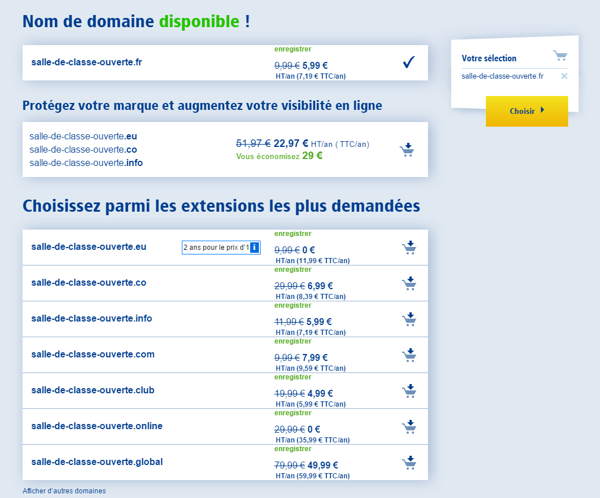
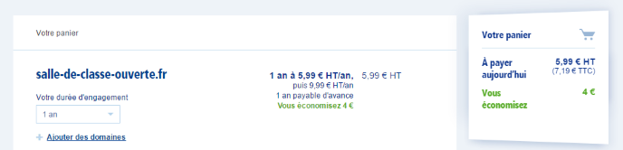

# Domaine : Achat, renouvellement et expiration

Maintenant que vous commencez à mieux comprendre ce qu'est un domaine, il s'agit d'en créé un en le commandant auprès d'un bureau d'enregistrement.

## Commander un nouveau nom de domaine

Heu ... mais je ne connais pas de bureau d’enregistrement, moi !

Ce n'est pas dur à trouver, la quasi majorité des sociétés fournissant des solutions d'hébergement web, de construction de site ou d'adresse emails sont aussi bureau d'enregistrement.

Concrètement il suffit d'aller sur leur page de commande, et de choisir le domaine et l'extension.

Exemple d'interface de commande chez [1&1](https://www.1and1.fr) :

On peut voir que l'interface nous informe que le domaine est bien disponible, nous informe du prix avec réduction et plein tarif et nous invite à commander le même domaine mais avec d'autres extensions.

> Qu'arrive-t-il si le domaine est déjà pris par quelqu'un d'autres ?

Vous ne pouvez pas le commander ! Sauf exception, la règle est premier arrivé, premier servit.

Les exceptions dépendent des extensions. Par exemple avec les .fr, si vous possédez une marque déposée à l'INPI (par exemple CoursDePros), vous pouvez en gros réclamer à l'Afnic de vous donner le domaine coursdepros.fr même si il est déjà pris par quelqu'un d'autre. De la même manière, avec les extensions  .vin et .wine, vous ne pouvez en fait commander un domaine correspondant au nom d'une Appellation d'Origine Contrôlée que si vous êtes le vigneron titulaire de cette AOC.

Du coup je ne peux pas commander n'importe quel domaine n'importe comment ?

Eh non, ça dépend déjà du bureau d'enregistrement qui ne permet pas forcément de commander toutes les extensions. Un autre frein à la commande d'un domaine se trouve être votre adresse postale.

Beaucoup d'extensions sont liées à un pays ( .fr ,  .de ), une région ( .bzh ,  .alsace ), voire une ville ( .paris ). Dans tous ces cas, vous devez justifier d'une adresse postale dans ces lieux si demandé par le registre.

Certaines extensions localisées n'ont pourtant pas ces restrictions. Les  .co  et  .io  par exemple sont respectivement les extensions de la Colombie et des Territoires britanniques de l'océan Indien mais peuvent être commandés par n'importe qui.

> Le prix semble dépendre des extensions ?

En effet, pour les extensions classiques le coût sera de l'ordre de 15€ ou moins par an mais certaines extensions peuvent être beaucoup plus chères : 50€ par an pour un  .paris , plus de 500€ par an pour un  .party  (ça fait cher la soirée :D).

Continuez le processus de commande chez 1&1 et vous arriverez à cet écran :

Ici la chose important à regarder est la durée d'engagement, ou dans ce cas, la période d'enregistrement du domaine. C'est la période initiale durant laquelle vous allez posséder le domaine, avant de le laisser expirer ou au contraire de le renouveler.

Chez 1&1, vous pouvez enregistrer les domaines pour une période de 1 à 5 ans. La durée dépend des bureaux et des registres. Notez bien que vous payez le domaine en avance, au moment de sa commande.

Si vous continuez le processus de commande, l'interface vous invite ensuite à créer votre compte client (ou à vous y connecter si il existe déjà). Typiquement, ce sont les données de contact de votre compte client qui sont automatiquement reproduites au moins pour le titulaire et le contact administratif du domaine. La mise à disposition du domaine après la commande prend généralement quelques heures.

> Mince, j'ai fait une faute dans le domaine, est-ce que je peux le changer ?

Non, l'orthographe d'un nom de domaine ne peut pas être modifiée ! Vous devez dans ce cas commander un nouveau domaine et éventuellement résilier le mauvais.

> Les noms de domaine sont _des biens nettement personnalisés_, comme un vêtement taillé sur-mesure. C'est pour cela que en droit français le délai de rétractation de 14 jours sur les commandes à distance __ne s'applique pas__ aux noms de domaine. C'est la même raison pour l’absence de remboursement en cas de résiliation anticipée.
>
> Et pourquoi je dépenserais de l'agent pour un domaine alors qu'il y a des domaines gratuits ?

Les _"domaines gratuits"_ sont en fait :

- pas vraiment gratuit,
- ou pas des domaines,
- ou ne vous appartiennent pas.

Les vrais nom de domaine gratuits le sont soit pour une durée limitée (la première année par exemple), soit inclus aux frais d'abonnement, par exemple d'un contrat d'hébergement.

Ou alors ce sont en fait des sous-domaines. C'est par exemple le service proposé par le site Azote.org. Les domaines fournis sont en fait des sous-domaine, par exemple du domaine _fr.nf_.

Il existe à ma connaissance une seule extension de domaine complètement gratuite, les  .tk .
Par contre c'est marqué dans leurs CGV que vous n'êtes en fait pas propriétaire des domaines que vous enregistrez gratuitement et (donc) qu'ils peuvent supprimer n'importe quel domaine, n'importe quand, qu'elle qu'en soit la raison (ou l'absence de raison). Cette extension est aussi réputée pour être utilisée par des sites pirates...

## Renouveler un domaine

Le renouvellement d'un domaine se fait potentiellement à la fin de la période d'enregistrement si son titulaire a souhaité le renouveler pour la même durée.

> Faut-il que je fasse quelque chose, que j'y pense, ou est-ce automatique ?

Si vous êtes sur de vouloir garder un domaine durablement, vous pouvez effectivement le mettre en renouvellement automatique. Il sera ainsi renouvelé quoi qu'il arrive et vous n'aurez pas à y penser.

Tous les bureaux d'enregistrement permettent de renouveler automatiquement les domaines, mais ce n'est pas forcément activé par défaut. Il faut donc que vous vérifiez dans vote compte client quel est le statut du renouvellement de votre domaine.

De toute façon, en tant que titulaire du domaine vous recevrez typiquement au moins un email vous informant de l'arrivée prochaine du renouvellement ou de l'expiration du domaine ainsi que de ce qu'il faut faire pour justement le renouveler ou le laisser expirer suivant le cas.

Le coût du renouvellement n'est pas forcément le même que lors de l'achat ou du précédent renouvellement.
Vous n'avez peu être plus de promotion, ou le coût a simplement changé.

> Mince, j'ai oublié de résilier un domaine que je ne voulais plus et il a été renouvelé !

Que ce soit parce que vous n'avez pas vérifié l'état de renouvellement du domaine, ou parce que vous pensez ne pas avoir reçut l'email vous informant du renouvellement, __c'est votre faute__.

Dans ce cas il convient surtout de s'assurer pour de bon que le domaine ne sera pas renouvelé la prochaine fois (au plus tôt dans un an). Vous pouvez aussi __demander gentiment__ au bureau d'enregistrement si il est possible exceptionnellement de supprimer le domaine tout de suite, en échange d'un remboursement. Mais rien n'est garanti.

## L'expiration, la fin de vie d'un domaine

Si vous ne souhaitez pas garder un domaine, il suffit de demander à ce qu'il ne soit pas renouvelé. Il disparaîtra alors de votre compte client à la fin de sa période d'enregistrement. Il est également possible de demander à supprimer le domaine avant la fin de sa période d'enregistrement.

> Et voilà, il est parti, c'est fini ?  :'(

## La rédemption

Non pas encore tout à fait. Après la suppression ou expiration d'un domaine, celui-ci entre en __période de rédemption__.

C'est une période durant typiquement deux mois pour les  .com  et un mois pour les  .fr  pendant laquelle le domaine n'est plus actif, mais n'est pas encore à nouveau disponible à l'achat. Durant celle-ci, seul l'ancien titulaire du domaine peut revenir sur sa décision et demander à l'ancien bureau d'enregistrement de récupérer le domaine.

Lorsque la période de rédemption se termine, c'est comme si le domaine n'avais jamais existé : tous les services qui y étaient liés ne sont plus accessible et les whois n'ont plus aucune information sur lui.

> Certaines Whois (par exemple le site domainbigdata.com) gardent les informations d'un domaine même après son expiration ou après que ses données de contact aient été anonymisées. Les hébergeurs n'ont aucun contrôle sur le comportement de ces sites. Si ils ont gardés des informations que vous souhaitez faire disparaître, vous devez les contacter individuellement.

Surtout, n'importe qui et _n'importe quoi_ peut en devenir titulaire en l'achetant auprès d'un bureau d'enregistrement.

> N'importe quoi ? C'est toi qui écrit n'importe quoi !

Les humains ne sont pas les seuls intéressés à acheter un nom de domaine ! Des sociétés partent du principe que si un domaine a été acheté, c'est qu'il présente un intérêt mercantile et donc que potentiellement quelqu'un d'autre sera prêt à payer pour avoir ce domaine.

Ils ont donc développé des robots qui passent leurs temps à surveiller les domaines qui vont expirer et à les acheter dès qu'ils sont disponible, afin de les proposer ensuite à la revente, généralement très cher. Heureusement cela ne concerne pas tous les domaines qui expirent.

> Mais comment ces sociétés peuvent-elle vendre ces domaines, je croyais que seuls les bureaux d'enregistrement pouvaient en vendre ?

Seuls les bureau d'enregistrement peuvent demander aux registres de créer de nouveaux domaines. Mais lorsque les domaines existent déjà, n'importe qui peut décider de vendre ceux qu'il possède à un tiers.

Les domaines peuvent changer de titulaire et éventuellement de bureau d'enregistrement lors d'une opération qu'on appelle le __transfert_, qui est justement le sujet du prochain chapitre !

> Mince, j'ai oublié de renouveler un domaine qui était important pour moi, maintenant plus rien ne fonctionne !

Vous le faites exprès, ma parole !

Là, ça dépend du bureau d'enregistrement.

Chez 1&1 par exemple, comme il faut une action de votre part pour ne pas renouveler un domaine, celui-ci entre directement en rédemption lorsqu'il expire. Si vous souhaitez en fait garder le domaine, en tant qu'ancien titulaire, vous pouvez le récupérer avant la fin de la période de rédemption, mais il vous faut contacter le S‌upport et en supporter le coût.

Chez OVH et Gandi a priori où le renouvellement n'est pas automatique par défaut, lorsqu'un client ne souhaite apparemment pas renouveler un domaine, il est en fait renouvelé puis désactivé. Si vous souhaitez garder le domaine, il faut revenir vers eux et ils vous le réactive tout simplement. Si vous n'êtes pas revenu vers eux au bout d'un mois, le domaine entre alors en rédemption.

## En résumé

- Lors de la commande d'un domaine vous choisissez le corps et l'extension du domaine, ainsi que sa période d'enregistrement.
- Le coût d'un domaine dépend de l'extension, ainsi que de la période et du bureau d'enregistrement (sans compter les éventuelles promotions).
Un domaine classique ( .fr ,  .org ,  .com ) coûte de l'ordre de 10 à 15€ par an.
- C'est vous qui choisissez si le domaine est renouvelé ou pas à la fin de la période d'enregistrement.
- La période de rédemption suit la suppression d'un domaine, celui-ci ne fonctionne plus mais l'ancien titulaire peut toujours demander à le récupérer durant cette période, avant la remise sur le marché.
- À la fin de la période de rédemption, le domaine n'existe plus, mais il peut être recréé à nouveau.
