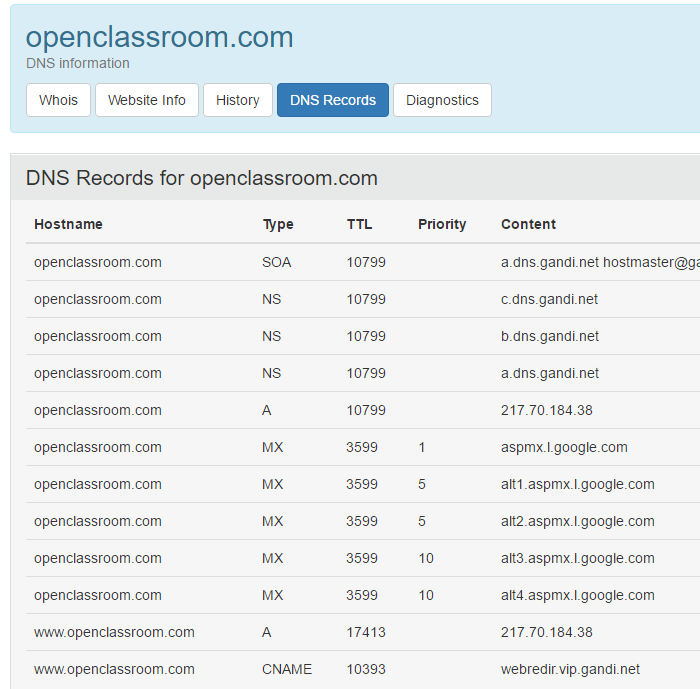

# Domaine : Gestion technique : les paramètres DNS

Pour l'instant vous avez vus tout ce qui a trait aux procédures administratives d'un domaine.

Mais bon vous n'allez pas vous amuser à acheter, transférer et supprimer votre domaine dans tous les sens. Vous voulez en faire quelque chose.

Vous avez donc besoin de gérer les __enregistrements__ de sa __zone DNS__.

> DN quoi ?

_DNS, Domaine Name System_ ou Système de Nom de Domaine en anglais. Concrètement le DNS est le système qui permet justement d'aller trouver les paramètres d'un nom de domaine par exemple lorsque vous le tapez dans la barre d'adresse de votre navigateur. Je ne vais pas détailler son fonctionnement, puisque ce n'est pas l'objet de ce cours, et que c'est déjà bien couvert justement par le cours [Gérer son nom de domaine](https://openclassrooms.com/courses/gerer-son-nom-de-domaine).

Ce qu'il faut savoir est que chaque domaine possède un __fichier de configuration__ qui contient ses paramètres et que l'on appelle la __zone__. Cette zone, ce fichier de configuration se trouve quelque part. Tout comme un site web se trouve sur un serveur web, la zone d'un domaine se trouve sur un __serveur DNS__, qu'on appelle aussi __serveur de nom__ (_name server_ en anglais).

Le bureau d'enregistrement vous met justement a disposition un serveur DNS ainsi que l'interface qui permet de gérer les paramètres de la zone des domaines que vous y achetez.

Vous pouvez d’ailleurs voir les serveurs DNS d'un domaine sur une whois. Essayez avec [openclassroom.com](https://who.is/whois/openclassroom.com) (_j'ai fait exprès de ne pas mettre de s à la fin !_).

Voyons donc maintenant les paramètres DNS les plus intéressants.

## Le contenu de la zone : les paramètres DNS

Chaque nom de domaine possède donc une série de paramètres de configuration, que l'on appelle plus précisément des __enregistrements__.

Voyons les enregistrements pour _openclassroom.com_ : Vous pouvez restez sur le site _who.is_ et cliquer sur le bouton _DNS Records_ ou utiliser d'autres sites tel que _digwebinterface.com_ que j'utilise souvent.

On constate qu'il y 5 types d'enregistrement dans cette zone : `SOA`, `NS`, `A`, `MX` et `CNAME` et que certains types d'enregistrements existent plusieurs fois avec des valeurs différentes.

Pour chaque enregistrement il y a d'abord le nom du domaine (ou du sous-domaine), puis le type, puis un chiffre qu'on appelle le _TTL_, puis sa valeur (et pour certains types une priorité).

L'enregistrement `NS` correspond aux serveurs DNS sur lesquels la zone est enregistrée, ce sont les même que l'on a vu dans la whois juste avant. Il y en a toujours au moins deux comme chez OVH, parfois trois comme ici chez Gandi ou encore quatre comme chez 1&1, rarement plus.

> Le but premier d'un nom de domaine (dans un cas d'utilisation la plus classique) est de mener un visiteur vers le site web via un navigateur et de diriger un email envoyé à une adresse dans la boite email du destinataire.

Pour cela, le système DNS va devoir trouver l'adresse IP du serveur sur lequel se trouve le site, même chose pour les serveurs où se trouvent les boites email.

Pour le site web, il va donc consulter l'enregistrement `A` de la zone DNS du domaine. Pour les emails, ce sont le ou les enregistrements `MX` qui sont consultés.

> Mais pourquoi il n'y a pas d'IP pour les  MX ?

Parce que c'est comme ça. Les enregistrements `MX` ont comme valeur un autre nom d'hôte (généralement un sous-domaine), qui lui a une adresse IP (défini par un enregistrement `A`). La priorité définie comme son nom l'indique quel serveur est à utiliser en premier. Plus la valeur de la priorité est basse, plus le serveur est prioritaire.

### Les sous-domaines

On voit aussi dans cette zone qu'il y a le sous domaine _www.openclassroom.com_ qui est défini.

> Pour créer un sous-domaine il suffit d'ajouter une ligne dans une zone DNS et de lui donner au moins un enregistrement. C'est pourquoi vous pouvez en créer un nombre généralement illimité et gratuitement.

Ici l'enregistrement qui nous intéresse est le type `CNAME` (prononcez _cénaime_).

Cet enregistrement est une sorte de raccourci, de copie : il indique que le domaine qui le possède a en fait exactement les même paramètres DNS que le domaine qui en est la cible.

Ainsi dans notre exemple, on voit que la cible (la valeur de l'enregistrement) est _webredir.vip.gandi.net_.

[Si on regarde](http://digwebinterface.com/?hostnames=+webredir.vip.gandi.net&type=ANY&colorize=on&ns=resolver&useresolver=8.8.4.4&nameservers=) les enregistrements sur ce sous-domaine de _gandi.net_ avec le site _digwebinterface.com_, on trouve :

	webredir.vip.gandi.net.   14357   IN   A   217.70.184.38

La whois a fait un raccourci en affichant aussi un enregistrement `A` pour le sous-domaine _www.openclassroom.com_ alors qu'en fait c'est _webredir.vip.gandi.net_ qui le possède.

> Les enregistrements `CNAME` ne sont __PAS__ des redirections.

Ecrire `monsite.fr CNAME monautresite.fr` n'est la plupart du temps pas suffisant pour créer une redirection de _monsite.fr_ vers _monautresite.fr_. Cela dépend de la configuration du serveur web hébergeant _monautresite.fr_.

> En plus de l'enregistrement `A` qui a pour valeur une adresse IP version 4, vous allez de plus en plus trouver aussi un enregistrement `AAAA` (prononcez _qwad A_) qui correspond lui à l'adresse IP version 6.
 
> Qu'on soit clair également : les enregistrements `A` et `AAAA` ne pointent pas vers des sites web, mais bien vers des adresses IP. Mais généralement, l'IP de l'enregistrement A d'un domaine sera celle d'un serveur web, et donc affichera le site correspondant au nom de domaine qui y est hébergé. Dans le cas des sous-domaines renseignés en tant qu'enregistrementMX d'un domaine, ils pointent vers l'IP d'un serveur d'email qui ne contient sans doute pas de site web.

### Les paramètres DNS par défaut

> Mais moi je n'ai jamais eu à modifier les paramètres DNS de mon domaine et le site et les emails fonctionnent pourtant bien !

En effet, lorsqu'un domaine est créé chez un hébergeur (suite à un achat ou un transfert), celui-ci lui mets ses propres paramètres DNS par défaut. Donc si vous utilisez les services d'hébergement de site web et d'adresse email de ce même hébergeur, ça marche tout seul. C'est bien pratique !

> Mais il n'est pas du tout obligatoire d'avoir tous les services chez le même hébergeur !

D'ailleurs pour le domaine _openclassroom.com_, peu être aurez-vous remarqué qu'il est enregistré chez Gandi, mais que les enregistrements MX se terminent par _googlemail.com_.

Les gestionnaires d'Open Classrooms ont décidés que les services d'email de Gandi ne conviennent pas à leur besoins. Ils ont donc modifiés les enregistrements MX par défaut, afin de pouvoir utiliser les services d'email de Google.

> Et est-ce que je peux aussi gérer la zone du domaine chez un autre hébergeur que le bureau d'enregistrement où je l'ai acheté ?

Oui tout à fait, et heureusement !

Tout ce que vous avez à faire du coté du bureau d'enregistrement est de modifier les serveurs DNS par ceux de l'hébergeur chez qui vous allez gérer la zone.

Ensuite, chez cet hébergeur, il vous suffit de __créer une zone DNS__ ou d'__ajouter un domaine externe__ (la terminologie dépend du prestataire), ce qui est généralement gratuit, à l'inverse des transferts.

### La propagation DNS

> Et est-ce qu'il faut aussi attendre comme pour les transferts ?

Oui, lorsque vous modifiez n'importe quel paramètre DNS -et a fortiori les serveurs DNS- vous devez attendre la fin de période de __propagation DNS__ qui dure typiquement jusqu'à 24 à 48 heures.

C'est dû au fonctionnement même du système DNS qui met en cache (qui sauvegarde) les enregistrements de la zone à divers endroits du web pendant une durée limitée. La période de propagation DNS est __l'attente de l'expiration de tous ces caches__. Une fois les caches expirés, les systèmes seront forcés d'aller demander à nouveau quels sont les serveurs DNS ou l'enregistrement A du domaine par exemple et donc à récupérer les nouvelles valeurs.

La durée de mise en cache dépend du type de l'enregistrement et est définie par la valeur du TTL (_time to leave_) dans la zone qui est un nombre de secondes. Les serveurs DNS ne changent pas souvent alors leur TTL est typiquement élevé, de l'ordre de plusieurs heures. À l'inverse, les enregistrements A ont souvent un TTL de seulement une heure (3600 secondes) afin de ne pas trop attendre si le site se fait déplacer.

## En résumé

- Le fichier de configuration technique du domaine est la zone DNS qui est située sur les serveurs DNS.
- La zone contient différents enregistrements qui sont liés à un domaine ou sous-domaine. Les enregis‌trements ont un type qui définit sont utilité et une valeur.
- Si vous utilisez tous les services du même hébergeur, vous n'aurez probablement même pas besoin de vous souciez des paramètres DNS de votre domaine.
- Si besoin il est toutefois possible d'avoir les différents services (domaine, zone DNS, site web, emails) à différents endroits, il faudra juste modifier en conséquence la valeurs des enregistrements.
